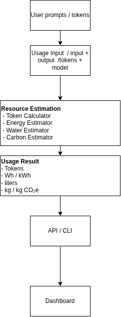

# llm-resource-meter
Estimate the real-world resource consumption of LLM usage, including tokens, energy, water, and carbon impact. The project helps users understand the environmental cost of their AI interactions and estimate consumption across individual sessions, days, months, or years.

# Architecture

                         
# repository structure
llm-resource-meter/
│
├── src/
│   └── resource_meter/
│       ├── models.py
│       ├── tokens.py
│       ├── energy.py
│       ├── water.py
│       ├── carbon.py
│       └── estimator.py
│
├── tests/
│   └── test_estimator.py
│
├── examples/
│   └── basic_estimate.py
│
├── README.md
├── pyproject.toml
└── LICENSE
